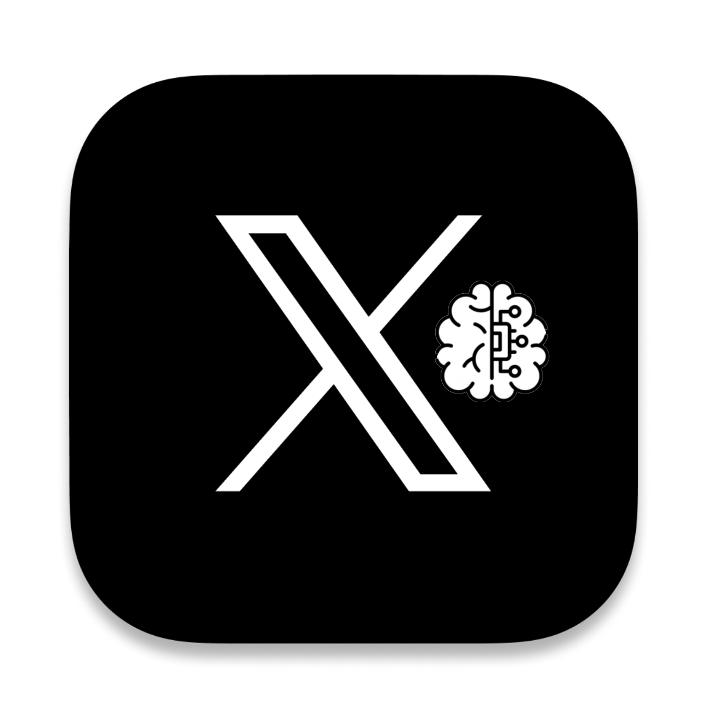
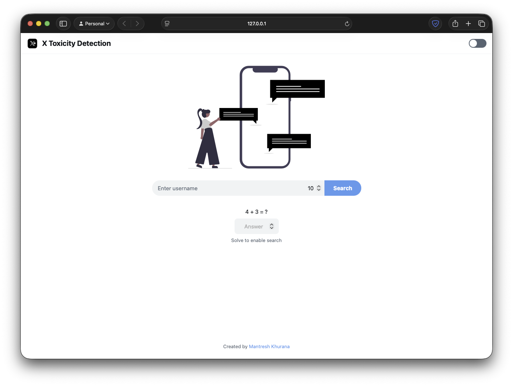
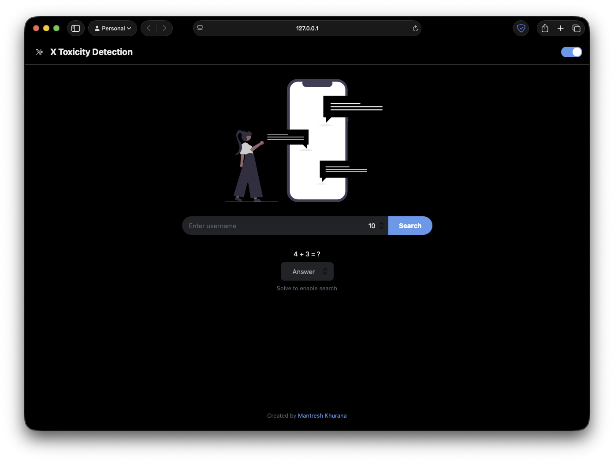
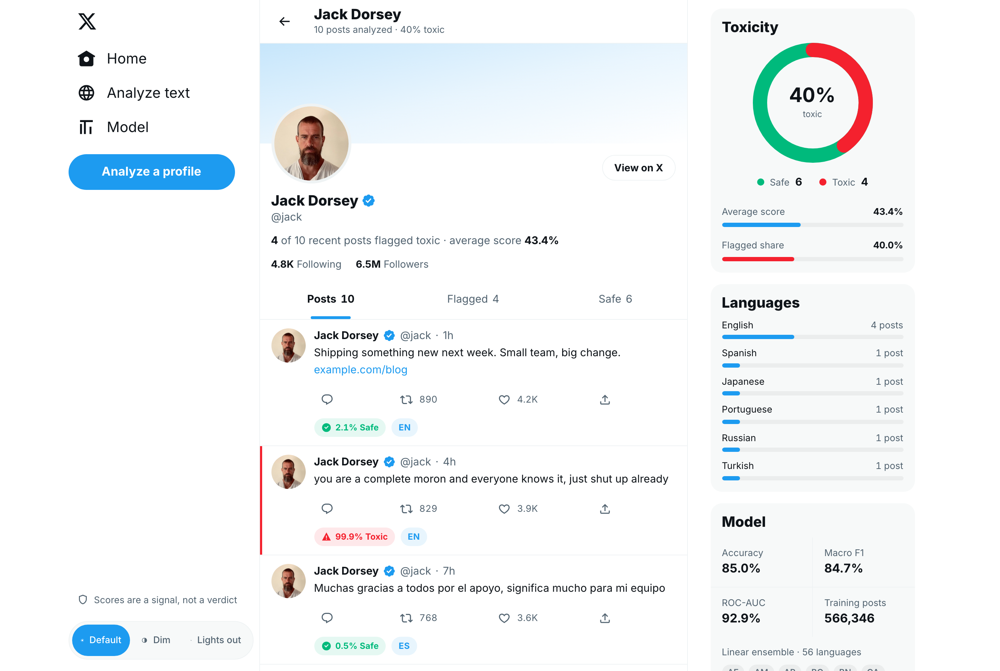
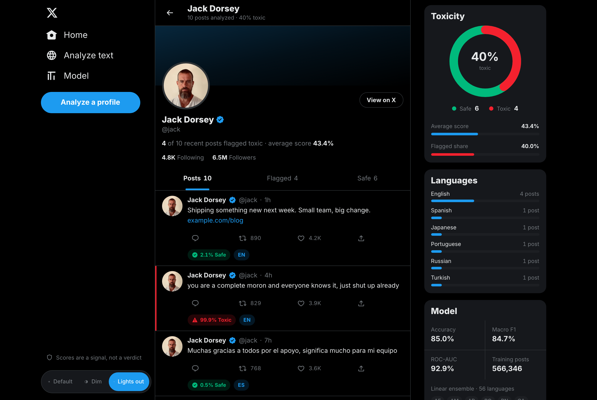
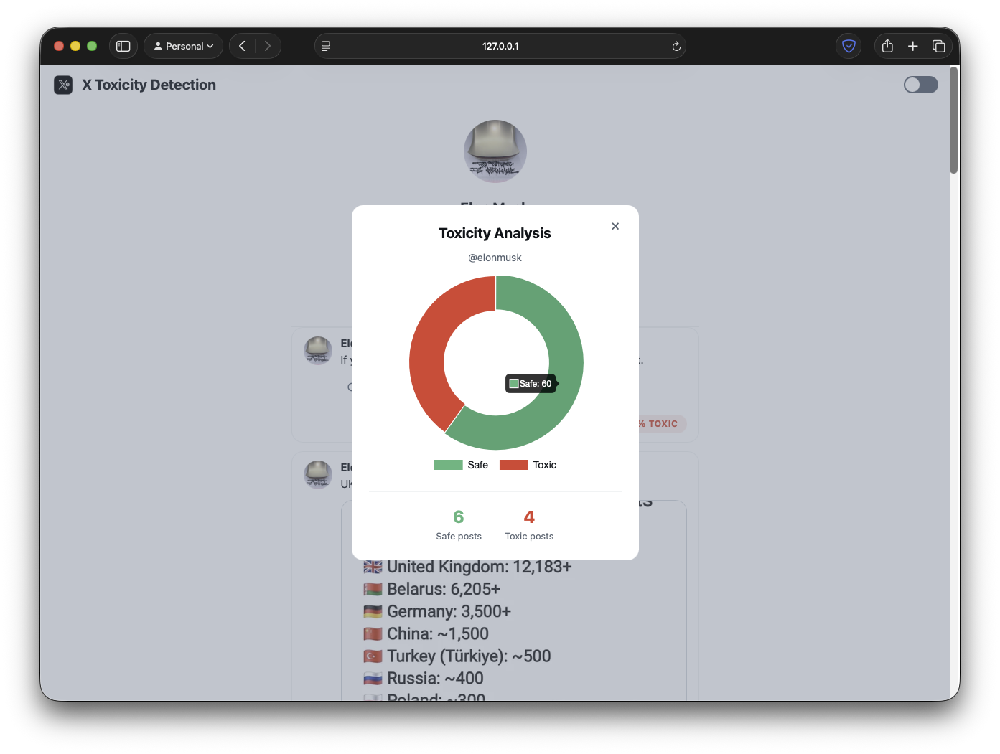
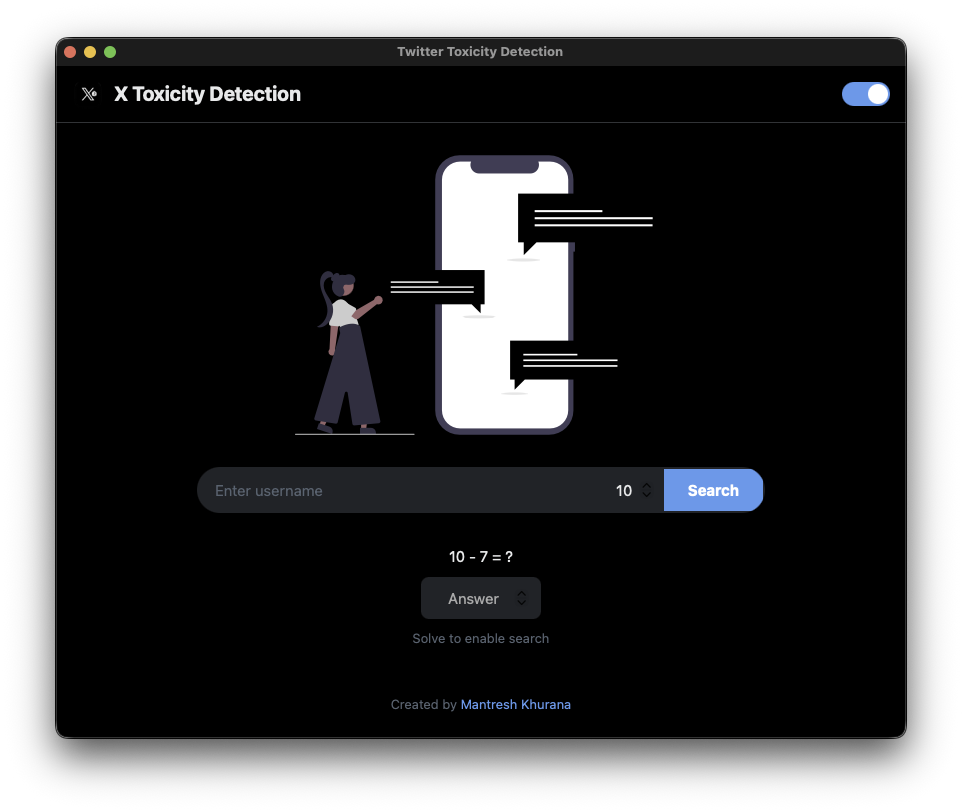

# X Toxicity Detection

A Flask web application that analyzes X (formerly Twitter) user posts for toxicity using a machine learning model. **No Twitter/X API required** - the app scrapes posts via Nitter instances and displays toxicity scores with a modern X-like UI.

It has a [Window GUI](#window-gui) version which can also be used to do the same without opening the browser.

## Table of Contents

- [X Toxicity Detection](#x-toxicity-detection)
  - [Demo](#demo)
    - [Demo Video](#demo-video)
    - [Screenshots](#screenshots)
    - [Pie Chart](#pie-chart)
    - [Window GUI](#window-gui)
  - [Installation](#installation)
  - [Usage](#usage)
  - [Features](#features)
  - [How It Works](#how-it-works)
  - [Project Structure](#project-structure)
  - [Contributing](#contributing)
  - [Author](#author)

## Demo

### Demo Video


https://github.com/user-attachments/assets/7793ebed-c52b-44f0-b24f-63f0a958e833


### Screenshots

| Light | Dark |
| :---: | :---: |
|  | 
|  | 

### Pie Chart

You can see a pie chart which portrays the percentage of tweets that are toxic and non-toxic. It can be viewed by clicking on the view Pie Chart button which is located below `following` and `followers` count.

<a align="left">
  
</a>

### Window GUI



## Installation

No API keys required! This app uses Nitter instances to fetch tweets.

### Using Virtual Environment (Recommended)

```bash
git clone https://github.com/mantreshkhurana/x-toxicity-detection-flask.git
cd x-toxicity-detection-flask
python -m venv venv
source venv/bin/activate  # on windows: venv\Scripts\activate
pip install -r requirements.txt
python app.py
```

### Without Virtual Environment

```bash
git clone https://github.com/mantreshkhurana/x-toxicity-detection-flask.git
cd x-toxicity-detection-flask
pip install -r requirements.txt
python app.py
```

Navigate to [http://127.0.0.1:5000/](http://127.0.0.1:5000/) in your web browser to use the app.

## Usage

```bash
python app.py
```

Run the app in a window GUI:

```bash
python app.py --window
# or
python app.py -w
```

Use a custom port:

```bash
python app.py --port 8000
# or
python app.py -p 8000
```

## Features

- [x] Search for a X user's recent tweets
- [x] Dark/Light mode toggle
- [x] View a pie chart for profile's toxicity ratio
- [x] View user's profile picture, name, username, following and followers count
- [x] View images in tweets
- [x] View retweets and likes count for each tweet
- [x] View the date and time of each tweet
- [x] X-like feed layout
- [x] Simple bot protection
- [x] Native GUI window support
- [x] No API keys required (uses Nitter scraping)
- [ ] Images/Videos toxicity detection

## How It Works

1. Enter a X/X username and the number of tweets to analyze
2. The app scrapes tweets from available Nitter instances
3. Each tweet is analyzed using a logistic regression model trained on hate speech data
4. Tweets are displayed with color coding (green for non-toxic, red for toxic)
5. An overall toxicity ratio is calculated and can be viewed as a pie chart

The toxicity detection model uses a CountVectorizer for text feature extraction and Logistic Regression for classification. A tweet is flagged as toxic if the model predicts a probability of 65% or higher.

## Project Structure

```txt
x-toxicity-detection-flask/
├── app.py                 # main flask application
├── models/
│   └── hate_speech_model.csv
├── static/
│   ├── css/
│   │   ├── style.css      # main stylesheet (imports modules)
│   │   ├── base.css       # reset and typography
│   │   ├── header.css     # header and navigation
│   │   ├── search.css     # search bar and bot protection
│   │   ├── profile.css    # profile card styles
│   │   ├── tweet.css      # tweet card styles (X-like UI)
│   │   └── components.css # footer, modals, errors
│   ├── js/
│   │   └── script.js
│   └── images/
│       ├── favicon.ico
│       └── hate_speech.svg
├── templates/
│   ├── index.html
│   ├── results.html
│   └── error.html
├── images/
│   └── logo.png
├── assets/
│   └── screenshots/
├── .gitignore
├── README.md
└── requirements.txt
```

## Contributing

Contributions are welcome! You can contribute to this project by forking it and making a pull request.

After forking:

```bash
git clone https://github.com/<your-username>/x-toxicity-detection-flask.git
cd x-toxicity-detection-flask
git checkout -b <your-branch-name>
# after adding your changes
git add .
git commit -m "your commit message"
git push origin <your-branch-name>
```

## Credits

- [Flask](https://www.fullstackpython.com/flask.html)
- [Nitter](https://github.com/zedeus/nitter)
- [Sklearn](https://scikit-learn.org/stable/)
- [Python](https://www.python.org/)
- [BeautifulSoup](https://www.crummy.com/software/BeautifulSoup/)
- [pywebview](https://pywebview.flowrl.com/)

## Author

- [Mantresh Khurana](https://github.com/mantreshkhurana)
