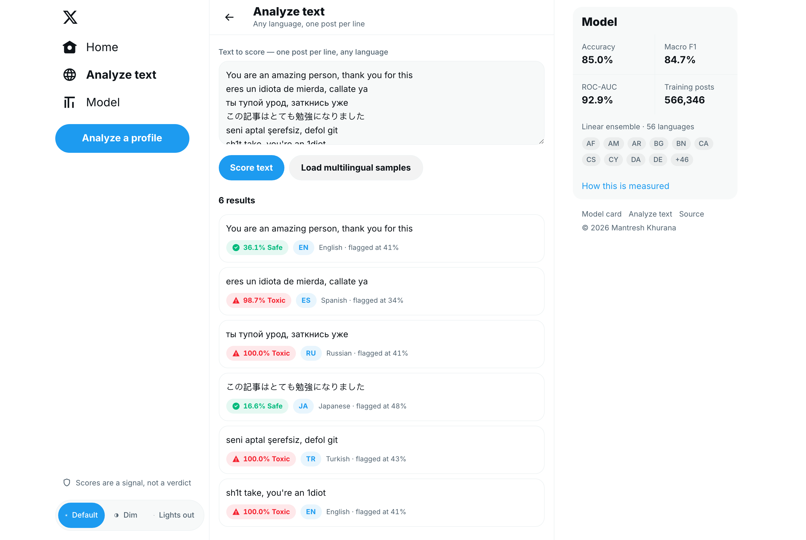
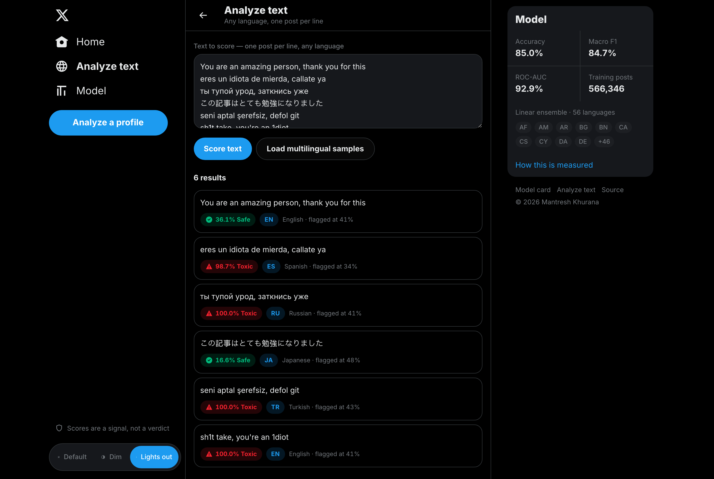
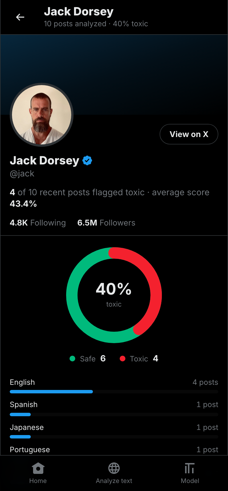

# X Toxicity Detection

Analyzes X (formerly Twitter) user posts for toxicity with a machine learning model that works in **56 languages**. **No Twitter/X API required** - posts come from X's public syndication endpoint.

Two processes, one command, one port: a Python service that owns the model and a **Next.js + React** interface in [web/](web/) built to look and behave like X itself - three-column layout, Default / Dim / Lights out themes, timeline and profile patterns. `python app.py` starts both and serves them on the port you choose.

## Table of Contents

- [X Toxicity Detection](#x-toxicity-detection)
  - [Demo](#demo)
    - [Demo Video](#demo-video)
    - [Screenshots](#screenshots)
    - [Mobile](#mobile)
  - [Installation](#installation)
  - [Usage](#usage)
  - [Frontend](#frontend)
    - [Deploying](#deploying)
  - [Features](#features)
  - [The Toxicity Model](#the-toxicity-model)
    - [Accuracy](#accuracy)
    - [Supported Languages](#supported-languages)
    - [Retraining](#retraining)
    - [Transformer Backend](#transformer-backend)
    - [Why Not 100%](#why-not-100)
  - [API](#api)
  - [How It Works](#how-it-works)
  - [Project Structure](#project-structure)
  - [Contributing](#contributing)
  - [Author](#author)

## Demo

### Demo Website

You can try the live demo of the app here: [https://x-toxicity-detection.onrender.com](https://x-toxicity-detection.onrender.com)

### Demo Video

Recorded on the previous server-rendered interface; the flow is the same, the interface is now the React app shown below.

<https://github.com/user-attachments/assets/7793ebed-c52b-44f0-b24f-63f0a958e833>

### Screenshots

| Light | Lights out |
| :---: | :---: |
|  |  |
|  |  |
|  |  |

### Mobile



## Installation

No API keys required. You need **Python 3.11+** and **Node.js 20+** (the interface is a Next.js app).

### Using Virtual Environment (Recommended)

```bash
git clone https://github.com/mantreshkhurana/x-toxicity-detection-flask.git
cd x-toxicity-detection-flask
python -m venv venv
source venv/bin/activate  # on windows: venv\Scripts\activate
pip install -r requirements.txt
python app.py
```

### Without Virtual Environment

```bash
git clone https://github.com/mantreshkhurana/x-toxicity-detection-flask.git
cd x-toxicity-detection-flask
pip install -r requirements.txt
python app.py
```

`python app.py` starts everything and installs the frontend's npm dependencies on first run. Open [http://127.0.0.1:3000](http://127.0.0.1:3000).

**One port serves the whole app.** The interface takes the port you choose and forwards `/api/*` to the Python service behind it, which stays on localhost. Ctrl-C stops both.

## Usage

```bash
python app.py                  # whole app on :3000
python app.py --port 8000      # whole app on :8000
python app.py --prod           # production build instead of dev mode
python app.py --window         # desktop window (needs pywebview)
python app.py --no-web         # API alone on --port, no interface
```

| Flag | Default | Meaning |
| :-- | :-- | :-- |
| `-p`, `--port` | `3000` | **the port you open** - serves the interface and `/api/*` |
| `--api-port` | `5000` | private port for the API behind it, on localhost only |
| `--prod` | off | `next build` + `next start` instead of dev mode |
| `-w`, `--window` | off | desktop window instead of a browser tab |
| `--no-web` | off | serve the API alone on `--port` (for split deployments) |

Both ports also read `PORT` and `API_PORT` from the environment. If either is taken, the next free port is used and printed rather than crashing:

```txt
[api] port 5000 is in use, using 5001
[web] port 3000 is in use, using 3001

  Open http://127.0.0.1:3001
  (API behind it on http://127.0.0.1:5001)
```

## Frontend

The interface is a Next.js + React app in [web/](web/), built to look and behave like X: three-column layout, Default / Dim / Lights out themes, timeline, profile header and tab bar, bottom nav on phones. It renders what the Python service returns - the model never moves out of Python.

| Route | What it does |
| :-- | :-- |
| `/` | Search a username and pick how many posts to analyze |
| `/u/[username]` | Profile header, scored timeline, Posts / Flagged / Safe tabs, toxicity donut, language mix |
| `/analyze` | Paste any text, one post per line, scored in any supported language |
| `/model` | Model card: pipeline, language list, measured accuracy |
| `/api/*` | Forwarded to the Python service, which is why one port is enough |

To work on the frontend alone, against an API you started separately:

```bash
python app.py --no-web &       # API on :3000... or wherever you point it
cd web
npm install
cp .env.example .env.local     # TOXICITY_API_URL
npm run dev
```

See [web/README.md](web/README.md) for the design notes.

### Deploying

**Render, two services (default).** Deploy [render.yaml](render.yaml) as a Blueprint and both halves build:

| Service | Runtime | Build | Serves |
| :-- | :-- | :-- | :-- |
| `x-toxicity-api` | Python | `pip install -r requirements.txt` + train if the model is missing | JSON API |
| `x-toxicity-web` | Node | `npm ci && npm run build` (rootDir `web`) | the interface |

`x-toxicity-web`'s URL is the app - that is the one to open and share, and it forwards `/api/*` to `x-toxicity-api` for you, exactly like the single port locally. Render injects the API's hostname as `TOXICITY_API_HOST`, and the frontend turns that into an `https://` URL on its own, so there is nothing to wire up by hand. The browser only ever talks to one origin, so no CORS configuration is needed. Gunicorn imports `app:app`, which means the frontend-spawning code in `__main__` never runs on the API service.

On Render's free plan both services sleep when idle, so the first request after a nap waits for two cold starts.

**One service instead of two.** [Dockerfile](Dockerfile) builds the frontend and the API into a single image, the same shape as running it locally: the interface takes the public `$PORT`, the API stays on `API_PORT` inside the container. Point a Render service (or Fly, or a VPS) at it:

```yaml
services:
  - type: web
    name: x-toxicity-detection
    runtime: docker
    dockerfilePath: ./Dockerfile
    healthCheckPath: /
```

```bash
docker build -t x-toxicity-detection .
docker run -p 3000:3000 -e PORT=3000 x-toxicity-detection
```

**Anywhere else.** Run the API with `python app.py --no-web` (or gunicorn) and the frontend with `npm run build && npm start`, setting `TOXICITY_API_URL` to wherever the API is reachable.

## Features

- [x] Search for an X user's recent posts
- [x] Toxicity detection in 56 languages, with the detected language shown per post
- [x] Obfuscation-resistant scoring (`f*ck`, `sh1t`, `f u c k`, `looool`, Cyrillic look-alikes)
- [x] Per-language decision thresholds instead of one global cut-off
- [x] Score arbitrary text in any supported language from `/analyze`
- [x] Toxicity donut and language breakdown per profile
- [x] Filter a timeline by flagged / safe
- [x] X's three themes: Default, Dim and Lights out
- [x] Responsive down to phone width, with a bottom nav
- [x] JSON API for scoring text or a whole profile
- [x] Optional transformer backend for maximum accuracy
- [x] Native GUI window support
- [x] No API keys required (public syndication endpoint)
- [ ] Images/Videos toxicity detection

## The Toxicity Model

Everything that turns text into a score lives in [toxicity.py](toxicity.py); training lives in [train_multilingual.py](train_multilingual.py). Both share the same normalization function, so what the model sees at inference is exactly what it saw during training.

**Pipeline**

1. **Normalization** - Unicode NFKC, invisible/bidi character stripping, URL and mention removal, hashtag unwrapping, and de-obfuscation: repeated characters (`fuuuuck`), interior leetspeak (`sh1t`, `f4ggot`), censoring symbols (`f*ck`), spaced-out letters (`f u c k`), and Cyrillic/Greek homoglyphs smuggled into Latin words.
2. **Features** - a union of word 1-2 grams and character 2-5 grams (`char_wb`). The character half is what makes one model work across 50+ languages: it handles agglutinative morphology, unsegmented scripts like Chinese, Japanese and Thai, and misspellings that word tokens miss entirely.
3. **Classifier** - a soft-voting ensemble of three linear models with different loss functions: logistic regression (well calibrated), a calibrated linear SVM (wider margin), and modified-Huber SGD (tolerant of label noise). They fail on different examples, so the average beats every member.
4. **Per-language thresholds** - the decision cut-off is tuned separately for each language on a validation split. A single global threshold systematically over-flags the languages the model is least certain about.

**Training data** - 566,346 deduplicated posts merged from four public corpora:

| Corpus | Rows used | Languages | Notes |
| :-- | --: | --: | :-- |
| [textdetox/multilingual_toxicity_dataset](https://huggingface.co/datasets/textdetox/multilingual_toxicity_dataset) | 71,374 | 15 | balanced, human-annotated |
| [FredZhang7/toxi-text-3M](https://huggingface.co/datasets/FredZhang7/toxi-text-3M) | 472,664 | 55 | sampled per language so English (88% of the corpus) cannot dominate |
| [Fallen03/COLDataset](https://huggingface.co/datasets/Fallen03/COLDataset) | 32,157 | 1 | Chinese offensive language |
| [smilegate-ai/kor_unsmile](https://huggingface.co/datasets/smilegate-ai/kor_unsmile) | 15,005 | 1 | Korean hate speech |

The last two exist because Chinese and Korean were the weakest languages in the merged data - a few hundred rows each. Adding them took Chinese accuracy from **58.6% to 86.6%** and gave Korean its first real coverage at 82.3%.

Rows whose text appears twice with contradictory labels are dropped rather than left to a coin flip.

### Accuracy

Measured on a 45,308-post held-out split that the model never saw during training or threshold tuning:

| Metric | Score |
| :-- | --: |
| Accuracy | **84.98%** |
| Macro F1 | **84.65%** |
| ROC-AUC | **92.92%** |
| Toxic-class F1 | 82.2% |

For comparison, the previous English-centric model scored macro F1 0.81 on a balanced 15-language set and collapsed to **0.49 macro F1 / 0.56 ROC-AUC** on out-of-domain multilingual data - barely better than a coin flip. The current model scores 0.65 macro F1 / 0.77 ROC-AUC on that same out-of-domain set, which is the honest number for text that looks nothing like the training corpora.

Per language, largest test slices first:

| Language | Test posts | Accuracy | Macro F1 |
| :-- | --: | --: | --: |
| English | 9,962 | 88.8% | 0.888 |
| Arabic | 4,352 | 81.6% | 0.783 |
| Turkish | 3,947 | 87.7% | 0.778 |
| Chinese | 2,965 | 86.6% | 0.866 |
| Portuguese | 2,958 | 77.7% | 0.756 |
| Russian | 2,385 | 87.3% | 0.855 |
| Spanish | 2,220 | 76.1% | 0.755 |
| French | 2,173 | 84.4% | 0.829 |
| Italian | 1,880 | 84.5% | 0.815 |
| Indonesian | 1,390 | 87.1% | 0.870 |
| German | 1,308 | 84.2% | 0.826 |
| Korean | 1,203 | 82.3% | 0.728 |
| Hindi | 1,152 | 74.1% | 0.741 |
| Greek | 825 | 83.4% | 0.789 |
| Japanese | 441 | 76.2% | 0.760 |

The weak spots are real and worth knowing: Hindi, Japanese and Amharic sit in the low-to-mid 70s, and Marathi has so few toxic examples (0.7% of its rows) that the model never predicts toxic for it.

Reproduce it yourself:

```bash
python evaluate_model.py           # held-out test split, per-language breakdown
python evaluate_model.py --smoke   # hand-written multilingual sanity set
```

### Supported Languages

56 languages have training data and a tuned or inherited threshold:

```txt
af am ar bg bn ca cs cy da de el en es et fa fi fr gu he hi hr hu id it ja kn
ko lt lv mk ml mr ne nl no pa pl pt ro ru sk sl so sq sv sw ta te th tl tr tt
uk ur vi zh
```

17 of them earned a language-specific decision threshold; the rest use the global cut-off (41%). Language detection is separate from the model: Unicode blocks resolve non-Latin scripts, decisive letters split the shared ones (`ї` means Ukrainian, `ў` Belarusian, `ğ` Turkish), and `langdetect` plus a function-word heuristic handles Latin script.

Text in a language with no training data still gets scored - the character n-grams generalize across related languages - it just gets the global threshold instead of a tuned one.

### Retraining

```bash
python train_multilingual.py                   # full run, all corpora (~566k rows, ~9 min)
python train_multilingual.py --preset fast     # textdetox only, about a minute
python train_multilingual.py --max-per-label 20000   # smaller sample per language
python train_multilingual.py --no-extras       # skip the Chinese and Korean corpora
```

The full preset downloads a 1.4 GB corpus on first run and caches it. Training writes `models/vectorizer.pkl`, `models/toxicity_model.pkl`, `models/model_meta.pkl` (metrics + thresholds) and `models/holdout.csv` (the test split, for `evaluate_model.py`). The app loads those at startup; it never trains at boot.

### Transformer Backend

For a few more points of accuracy at the cost of RAM and a multi-gigabyte download, swap the linear model for a fine-tuned XLM-RoBERTa classifier:

```bash
pip install -r requirements-transformer.txt
TOXICITY_BACKEND=transformer python app.py
# any HF sequence-classification model works:
TOXICITY_MODEL_ID=textdetox/xlmr-large-toxicity-classifier python app.py
```

| Variable | Values | Meaning |
| :-- | :-- | :-- |
| `TOXICITY_BACKEND` | `auto`, `linear`, `transformer` | which model answers; `auto` uses the transformer only when its dependencies **and** `TOXICITY_MODEL_ID` are set |
| `TOXICITY_MODEL_ID` | any HF model id | checkpoint for the transformer backend |
| `TOXICITY_THRESHOLD` | `0`-`100` | override every threshold with one fixed cut-off |

### Why Not 100%

There is no 100% here, and any toxicity classifier claiming it is reporting its training error. Toxicity is a judgement call, not a fact: human annotators on these datasets disagree with each other a meaningful share of the time, sarcasm and reclaimed slurs invert the label depending on who is speaking, and the same sentence can be a joke between friends or harassment from a stranger. A model cannot be more consistent than the labels it learned from.

What is achievable, and what this model does: score every language it can, refuse to be fooled by the usual obfuscation tricks, calibrate its confidence per language, and publish the numbers above so you can decide whether they are good enough for your use. Treat the score as a ranking signal for human review, not a verdict.

## API

Reachable on the same port as the interface (`:3000` by default), because `/api/*` is forwarded through to the Python service:

```bash
# what model is answering
curl http://127.0.0.1:3000/api/model

# score arbitrary text in any supported language
curl -X POST http://127.0.0.1:3000/api/analyze \
  -H 'Content-Type: application/json' \
  -d '{"texts": ["you are trash", "gracias por compartir", "ты тупой урод"]}'
```

```json
{
  "backend": "linear",
  "results": [
    {"text": "you are trash",         "score": 84.65, "is_toxic": true,  "language": "en", "threshold": 41.0},
    {"text": "gracias por compartir", "score": 1.99,  "is_toxic": false, "language": "es", "threshold": 34.0},
    {"text": "ты тупой урод",         "score": 100.0, "is_toxic": true,  "language": "ru", "threshold": 41.0}
  ]
}
```

A whole profile, scored, is one call — this is what the Next.js frontend renders:

```bash
curl "http://127.0.0.1:3000/api/profile/jack?posts=20"
```

It returns the user, a summary (totals, toxic ratio, average score, language mix), the model info, and every post with its own score, language and threshold.

## How It Works

1. `python app.py` starts the Next.js interface on the port you chose and the Python API behind it on localhost; `/api/*` is forwarded through, so one URL serves everything
2. Enter a username and how many posts to analyze
3. The API fetches those posts from X's public syndication endpoint - no API key, no login
4. Every post is scored in one batched pass: language detected, toxicity probability computed, threshold applied for that language
5. The frontend renders the timeline with per-post scores and language badges, plus a toxicity donut and language breakdown for the profile

## Project Structure

```txt
x-toxicity-detection-flask/
├── app.py                 # JSON API + scraping; starts the frontend
├── frontend.py            # supervises the Next.js child process
├── toxicity.py            # normalization, language detection, scoring backends
├── train_multilingual.py  # trains and persists the model
├── evaluate_model.py      # accuracy report + multilingual smoke test
├── models/
│   ├── vectorizer.pkl     # fitted word + char TF-IDF union
│   ├── toxicity_model.pkl # soft-voting linear ensemble
│   ├── model_meta.pkl     # metrics, languages, per-language thresholds
│   └── holdout.csv        # held-out test split
├── web/                   # next.js + react frontend (see web/README.md)
│   ├── app/               # routes: /, /u/[username], /analyze, /model
│   ├── components/        # sidebar, timeline, tweet card, donut, badges
│   └── lib/               # api client, types, formatting
├── images/
│   └── logo.png
├── assets/
│   └── screenshots/
├── .gitignore
├── README.md
├── requirements.txt
└── requirements-transformer.txt   # optional transformer backend
```

## Contributing

Contributions are welcome! You can contribute to this project by forking it and making a pull request.

After forking:

```bash
git clone https://github.com/<your-username>/x-toxicity-detection-flask.git
cd x-toxicity-detection-flask
git checkout -b <your-branch-name>
# after adding your changes
git add .
git commit -m "your commit message"
git push origin <your-branch-name>
```

## Credits

- [Flask](https://www.fullstackpython.com/flask.html)
- [Sklearn](https://scikit-learn.org/stable/)
- [Python](https://www.python.org/)
- [BeautifulSoup](https://www.crummy.com/software/BeautifulSoup/)
- [pywebview](https://pywebview.flowrl.com/)
- [textdetox/multilingual_toxicity_dataset](https://huggingface.co/datasets/textdetox/multilingual_toxicity_dataset)
- [FredZhang7/toxi-text-3M](https://huggingface.co/datasets/FredZhang7/toxi-text-3M)
- [langdetect](https://github.com/Mimino666/langdetect)

## Author

- [Mantresh Khurana](https://github.com/mantreshkhurana)
